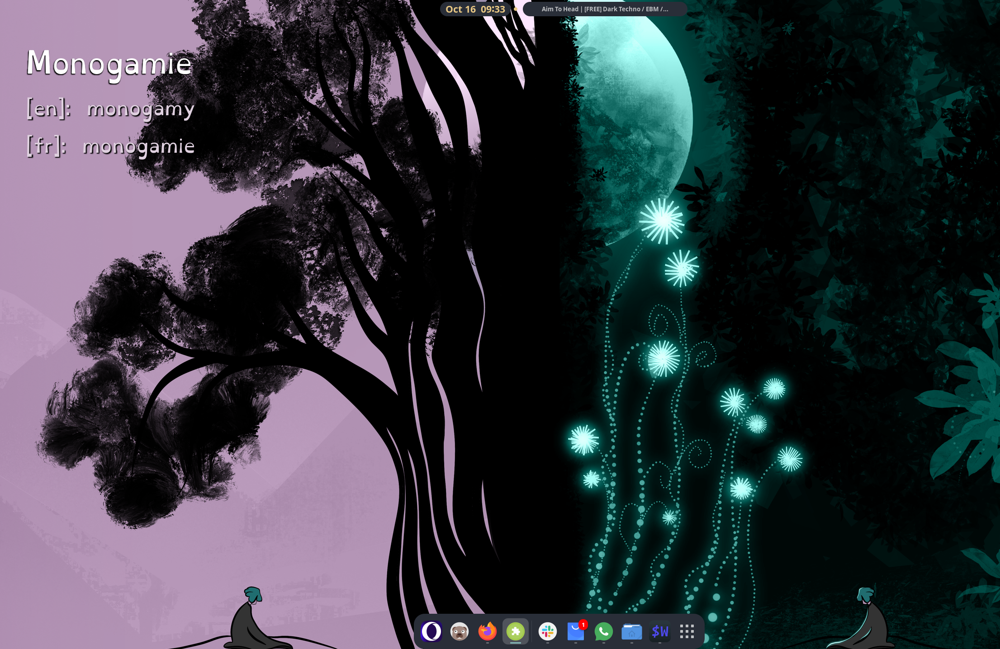
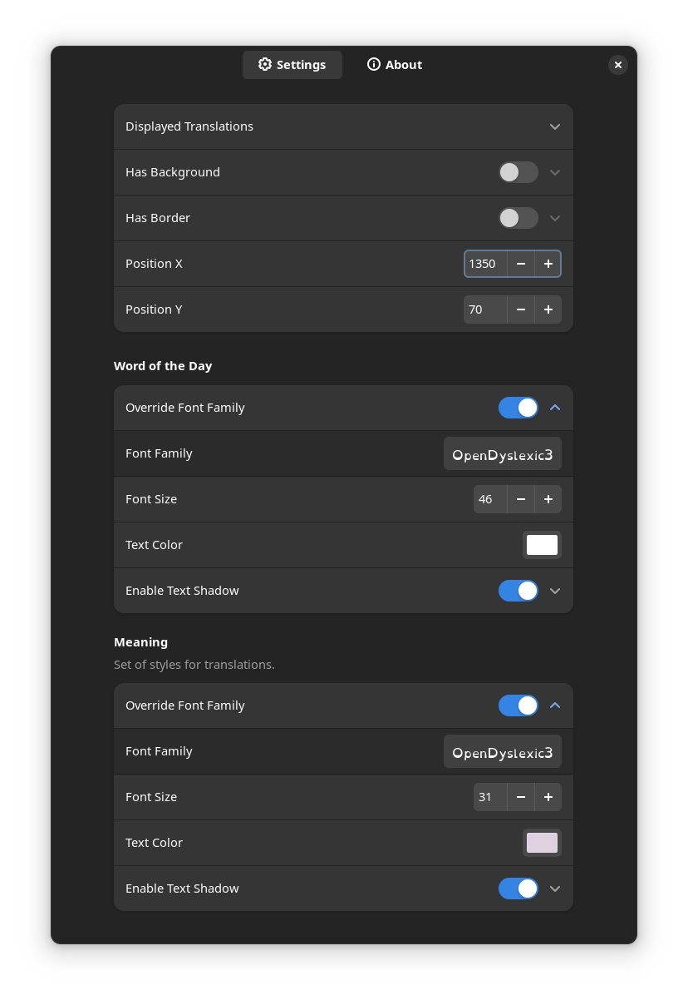
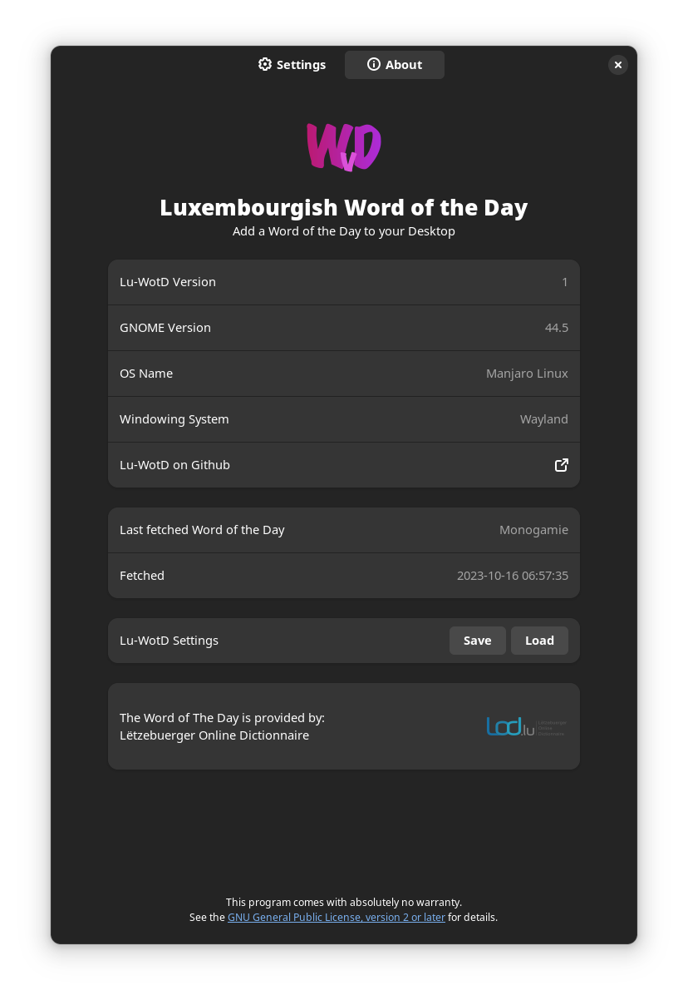

# lu-wotd

It displays Luxembourgish's "The Word of the Day" on the desktop. It gets them (wotds) from [lod.lu](https://LOD.lu)

## The origin story

The whole idea of this extension was to have a Word of the Day displayed on my desktop.

More or less like this:



This extension gets words from [LOD.lu](https://LOD.lu) and their awesome [API](https://lod.lu/api/lb/word-of-the-day).

I would love to thank to Andrew Zaech and his excellent Gnome-extension [AZClock](https://gitlab.com/AndrewZaech/azclock) for the inspiration and "teaching" process.

This is my the very first extension I ever created and by analyzing Andrew's AZClock source code I have learned a lot.

## Settings



For now the WotD position is set as (x,y) from the top left of the screen. (In the future I will make it work as relative position of the anchoring point such as TOP,RIGHT)

As I said many thanks to Lod team for allowing using lod.lu API.



## Installation

Hopefully it will be accessible from Gnome-extension website. For now you can install it manually.

### Gnome Extension Repository

Not yet available.

### Manual 

Download the ZIP file and unpack it.

```bash
unzip lu-wotd-main.zip
cd src
mkdir ~/.local/gnome-shell/extensions/lu-wotd@praczet.github.com
cp -r * ~./local/gnome-shell/extensions/lu-wotd@praczet.github.com/
```
## Plans

1. Adding translation (for now it has fake approach for it)
2. Adding anchoring = TOP-LEFT, TOP-RIGHT, BOTTOM-LEFT, BOTTOM-RIGHT
3. Adding Refresh button


